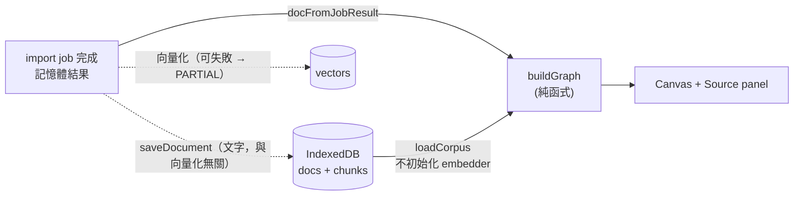

# HyperForge · 混沌煉金工廠

Local-first 知識煉金工廠（開發中，目前完成：投放口、管線動畫、向量庫與多語言 embedding、第 4 輪「Infinite Alchemy Canvas」概念圖譜畫布）。

## 開始

需要 Node.js LTS 20 或 22。首次 `npm install`，再取得自託管的模型與 wasm（約 135 MB，不入版控）：

```bash
npm install
npm run fetch-model   # 下載多語言 embedding 模型（約 135 MB，SHA256 校驗）到 public/models，複製 onnxruntime wasm 到 public/ort
npm run dev
npm run typecheck
npm test
```

## 目前狀態

| 階段 | 狀態 |
| --- | --- |
| PARSE / DECONSTRUCT / LINK | 文字類檔案與貼上文字為真實處理；token 為近似值（CJK 逐字、其餘以空白分詞）。LINK = 關鍵字 + 向量化（embedding → 單一 transaction 寫入 IndexedDB → 插入記憶體 HNSW）；向量化只在注入可用的 `Embedder` 時執行，否則略過並標 `indexed=false`、job 為 PARTIAL |
| RECOMBINE / EVOLVE / MANIFEST | skipped / 未接入，進度條不動；job 完成時顯示 PARTIAL，不是 DONE |
| 畫布（第 4 輪） | 概念圖譜 Canvas：只依賴文件文字，與 embedding 解耦；見下方「畫布」一節 |
| PDF / 圖片 / 音訊 / 影片 / zip | 尚未支援，拖入會顯示錯誤 |
| URL（YouTube / GitHub / 網頁） | 尚未支援（不發任何網路請求），顯示錯誤 |
| DECONSTRUCT 進度 | 切 chunk 為同步純函式，進度一次跳到 100%，非逐塊真實進度 |
| 中文關鍵字（LINK 階段） | LINK 的關鍵字抽取會濾掉單字 token，中文暫無關鍵字（job 卡片上的列表）；畫布有獨立的概念抽取，見「畫布」一節 |

## 畫布（第 4 輪 · Infinite Alchemy Canvas）

資料流（圖譜只依賴「文件文字 + chunk 位移」，**不依賴向量**；embedding / 模型不可用時畫布照常運作）：



- **兩條來源**：剛完成的 job 直接以記憶體結果建圖（不重讀 DB）；重新整理後由 IndexedDB 的 `docs` / `chunks` 重建（只讀這兩張表，不建立 embedder）。同一份內容（SHA-256 / 相同文字）只算一次。
- **文字先行持久化**：`saveDocument` 在向量化之前／無論成敗都寫入文字；之後若向量化成功，`VectorStore.ingest` 對同一 docId **只補寫向量**（本輪為此修改了 `index-store.ts`；舊行為是向量化成功才寫入任何資料）。
- **向量化失敗只降級，不影響畫布**：`runPipeline` 的 LINK 階段把 `isAvailable` / `ingest` 的任何失敗（模型檔存在但載入或推論失敗等）降級為 `indexed=false`（job 為 PARTIAL，LINK 註記失敗原因，不使用假向量），文字照常進畫布與 IndexedDB；只有取消（AbortError）會往外丟。
- **向量／語意狀態**只是狀態列資訊（`lib/vector/status.ts` 對同源模型檔發 HEAD，缺模型時只發 1 個請求），畫布不等待它。
- **概念抽取**（`lib/graph/extract.ts`）：句子 → 依 Unicode script 切 run → Latin token／Han 段（以標點與停用詞切段）→ 2–3 字 n-gram → 以「重複出現的片段覆蓋最多字」選詞（DP）→ 詞頻／文件頻率評分。**中文為統計近似，非中文斷詞**；無詞典、無 NLP tokenizer。詞需在語料中至少出現 2 次，文件至少 8 個單位才納入。
- **人名**僅為**英文啟發式（heuristic）**（連續 2–3 個首字大寫單字，或 Dr./Mr./Ms. + 姓）；非 NER、非 AI，不支援中文人名；UI 與資料模型皆標 `heuristic`。
- **邊**只有 co-occurrence（同一句子內共同出現，權重＝句數）。**沒有** vector-similarity／semantic 邊；那需要另開一輪設計（chunk vector → 概念證據歸屬 → 概念相似度），不可直接全對全 cosine。
- **上限**（`lib/graph/constants.ts`）：`MAX_GRAPH_NODES = 150`、`MAX_GRAPH_EDGES = 600`；超過時依分數／權重截取，UI 明示「顯示前 150 個概念（共 N 個）」。
- **決定性**：節點 id ＝ `kind:正規化詞`；初始位置只取決於節點 id（seeded），所以新增文件不會讓既有節點跳位；physics 無隨機數。
- **Physics**（`lib/graph/physics.ts`）：排斥、彈簧、中心重力、阻尼、每 tick 碰撞分離、拖曳 pin、固定時間步長、休眠。O(n²) 排斥，規模設計為 ≤ 約 170 節點。位置／速度在 ref（`GraphController`），不每 frame 寫 React state；rAF 迴圈由 `FrameLoop` 管理（cleanup、單一迴圈、休眠即停）。
- **互動**：空白處拖曳＝平移；Shift+拖曳（或「框選模式」）＝框選（任意方向）；滾輪＝以游標為中心縮放（native `{ passive: false }` + `preventDefault`）；拖節點＝pin → 移動 → 放開；點擊／Shift+點擊選取；「適合畫面」；右鍵 →「煉成新概念」。
- **煉成新概念**：選取 ≥ 2 個節點後右鍵，產生**本機暫存**節點（可自訂名稱，預設 `A × B`）。不呼叫 AI、不寫 IndexedDB、標示「暫存」，重新整理即消失。
- **安全**：節點名稱以 Canvas `fillText` 繪製；Source panel 只用 React text node。`lib/graph/security.test.ts` 以 hostile fixture 驗證，並掃描原始碼禁止 `innerHTML` / `dangerouslySetInnerHTML` 等。
- **測試輔助**：網址帶 `?e2e=1` 時，頁面會掛上**唯讀**的 `window.__HYPERFORGE_E2E__`（節點螢幕座標、frame 計時），供 `scripts/e2e/` 的瀏覽器驗收使用；正式使用不需要。

### 概念抽取的已知限制（皆未做準確率評估）

- 中文統計近似會產生：泛用動詞／名詞（保持、安裝、施工…）、重複出現的片語被當成詞、4 字以上詞被切成兩個 2 字詞。停用詞表為手工清單，覆蓋度未評估；3 字詞凝聚度門檻 `0.8` 為經驗值，未對大型語料校準。
- 只處理 Han 與 Latin 兩種 script（不含假名、諺文）；Latin 不做詞幹還原（單複數視為不同詞）。
- 人名 heuristic 會把 Title Case 片語誤判為人名，也會漏掉小寫或單一名字；誤判率未量測。
- 句子邊界為規則式（`。！？；!?;` 與換行；`.` 僅在後接空白、前非數字且非縮寫時）。
- `buildGraph` 在**主執行緒同步**執行，且每新增一份文件就重算整個語料（Web Worker 為後續輪次）。Node 實測：2 萬字 67 ms、20 萬字 360 ms、100 萬字（隨機漢字最壞情況）約 3.2 秒。
- 畫布在 job **完成時**才取得該文件（記憶體結果），所以向量化較慢時（真模型約數秒，且在主執行緒）畫布也要等到向量化結束；向量化「失敗」不會讓畫布空白，但「慢」會讓它晚出現。
- 150 節點在「適合畫面」時標籤會做防碰撞省略，放大後才會出現較多標籤。
- 尚未實作文件（source/document）節點，也沒有刪除文件的 UI。

### 瀏覽器驗收

```bash
npm run build && npm start                       # 必須是正式 build
node scripts/e2e/canvas-acceptance.cjs           # 需 Playwright；預設假設模型檔未安裝；E2E_ONLY=embed-failure 只跑「模型檔看似存在但載入失敗」那一步
npx next dev -p 3100 && node scripts/e2e/strictmode-single-loop.cjs   # 另見檔頭說明的限制
```

## 向量庫（第 2 輪）

- `lib/vector/hnsw.ts`：自建 HNSW（cosine、可重現 seed、可序列化）。
- `lib/vector/db.ts`：Dexie schema v1（`docs` / `chunks` / `vectors` / `meta`）。向量獨立成表；chunk 主鍵 `docId:index`，docId 為內容 SHA-256。未來欄位變更請新增 `version(2).upgrade`，不要改 `version(1)`。
- `lib/vector/index-store.ts`：寫入具原子性（取消或失敗不留半個 doc）；`meta` 記錄 embed 模型與維度，不符時拒絕（`ModelMismatchError`）。
- HNSW 索引只存記憶體，啟動時由 `vectors` 表重建；大型庫重建成本與索引持久化列待辦。
- **真 embedder**：`lib/vector/transformers-embedder.ts`（`@xenova/transformers` v2 舊套件，預設為多語言 paraphrase-multilingual-MiniLM-L12-v2 量化版，dim 384；詳見下方「Embedding 模型須知」）。僅限瀏覽器；模型與 wasm 自託管於 `public/models`、`public/ort`，`allowRemoteModels=false`，不連外。`next.config.mjs` 把 `sharp`、`onnxruntime-node` alias 為 false。模型檔不存在時 `isAvailable()` 為 false，管線降級為 PARTIAL（不用假向量）。`lib/vector/runtime.ts` 以單一 promise 初始化全域 VectorStore。`FakeEmbedder`（`fake-embedder.test-util.ts`）僅供測試，`lib/no-fake-in-product.test.ts` 會檢查非測試檔不得 import。
- 內容雜湊用 `crypto.subtle`，只在 `localhost` 或 https 可用（用區網 IP 開 dev 會失敗）。

## Embedding 模型須知

- **預設模型**：`Xenova/paraphrase-multilingual-MiniLM-L12-v2`（量化，384 維，約 118 MB，另有 tokenizer 約 17 MB），支援繁中。`npm run fetch-model` 固定到 commit `2c4055b1…`，每個檔案都寫死 byte size 與 SHA256（onnx 與 tokenizer.json 為 HF LFS 公布的 oid；小檔無上游雜湊，為一次性人工確認），下載到 `.tmp` 驗證通過才 rename。授權請自行在 HF 模型頁核對。
- 英文模型 `all-MiniLM-L6-v2`（約 23 MB）腳本仍支援（`node scripts/fetch-model.mjs --model=minilm-l6`），**但不是預設**，且程式目前只載入預設模型；是否移除之後再決定。
- **切窗**：以 tokenizer 實際 token 數切 window（不用字數猜），每窗內容 ≤ 126（`maxSeq=128` 扣掉 [CLS]/[SEP]；128 來自模型卡 `max_seq_length`，寫在 `lib/vector/model-spec.ts`，並檢查 ≤ `tokenizer.model_max_length`）。各窗分別推論，以 token 數加權平均後 L2 正規化。
- **成本**：一個 500 近似 token 的 chunk 約切成 4–6 窗各做一次推論。實測（瀏覽器、numThreads=1、主執行緒、正式建置）：約 2,200 近似 token 的中英混合文件（6 個 chunk）熱機約 4.9 秒；首次含載入模型約 7 秒。推論期間 UI 會卡頓，Web Worker 列待辦。
- **舊資料庫**：換模型後 IndexedDB 內舊向量不可混用。偵測到時，job 的 LINK note 會顯示「向量庫為舊模型建立，需重建」並降級為 PARTIAL。重置：DevTools → Application → IndexedDB → 刪除 `hyperforge`；或在程式中呼叫 `resetVectorDb()`（`lib/vector/runtime.ts`），再重新載入頁面。
- `@xenova/transformers` v2 已停止維護，內含較舊的 onnxruntime-web（1.14.0）。wasm 由 `scripts/copy-ort.mjs` 從該套件實際解析到的 onnxruntime-web 複製。
- `next.config.mjs` 的 alias 只對 webpack 生效：**dev / build 請勿加 `--turbopack`**。
- 「離線」目前指**不依賴外部網路**（模型、wasm、字型皆為本機來源；實測所有請求的 origin 只有 localhost）。專案尚無 service worker，PWA 離線快取是後續輪次，屆時需預快取 `public/models`、`public/ort`。
- `vitest` 不涵蓋真模型（只用注入的假 extractor/tokenizer 測邏輯）。真模型的繁中語意 baseline 見 `lib/vector/baselines/zh-semantic.json`（含模型 revision、SHA 與取得方式），只能在瀏覽器重新取得。

## npm audit（尚未處理，未使用 --force）

共 12 項（critical 2、high 6、moderate 4）。處理原則：不強制升 Next / Transformers / ONNX（皆為 breaking）。

| package | severity | 路徑 | 進 production bundle？ | 備註 |
| --- | --- | --- | --- | --- |
| protobufjs | critical | @xenova/transformers → onnxruntime-web → onnx-proto → protobufjs 6.11.6 | **是**（onnx proto 程式碼在 client chunk） | 弱點多為「解析不受信任的 proto / 生成程式碼」；本專案只載入固定、已校驗 SHA256 的本機模型，攻擊面小 |
| onnx-proto / onnxruntime-web | high | 同上 | 是 | 隨 protobufjs；修法是降到 @xenova/transformers@1.4.2（反向 breaking，不採用） |
| sharp | high | @xenova/transformers → sharp 0.32.6；next → sharp 0.35.5 | 否（webpack alias 為 false；Next 的 sharp 僅 server 圖片最佳化，本專案未用） | |
| postcss | high | next 內嵌 postcss 8.4.31 | 否（build time CSS 處理） | 修法為 next@16（breaking） |
| next | moderate | 經 postcss | 是（框架本身） | 僅 postcss 轉移；待 Next 15.x 內修補或升 16 |
| vitest / vite / esbuild / @vitest/mocker / vite-node | critical / high / moderate | devDependencies | 否（僅開發測試；弱點需開 Vitest UI / dev server 才觸發） | 修法為 vitest@5（breaking），可之後單獨升 |

可行方案：(1) 現況可接受（本機工具、固定模型）；(2) 單獨升 vitest 5 處理 dev 類；(3) 等 Transformers.js v3（@huggingface/transformers，新版 onnxruntime-web）再評估遷移，需使用者決定。

## 待辦備忘

- embedding 目前在主執行緒推論（numThreads=1，避免需要 COOP/COEP），應改 Web Worker。
- 巨檔切 chunk 會同步佔用主執行緒，需改為分批或 Worker。
- `Chunk` 的 start/end 位移已就緒；之後存 DB 需定 schema 版本。
- 若 `framer-motion` 與 React 19 出現 peer 衝突，請以 `^12` 為準。

- transformers.js / tesseract.js / pdfjs 的模型與 wasm 預設走 CDN，與零後端、離線 PWA 衝突，後續須自託管至 `public/`。
- `reference/Hyperforge.html`：來源不明的舊 artifact，僅供參考，未被引用（依使用者決定已搬入）。
