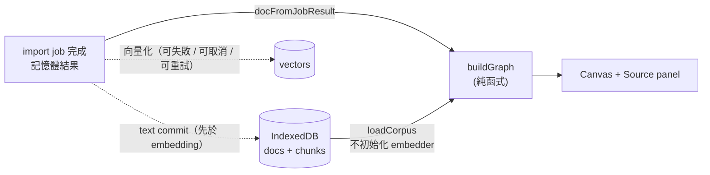
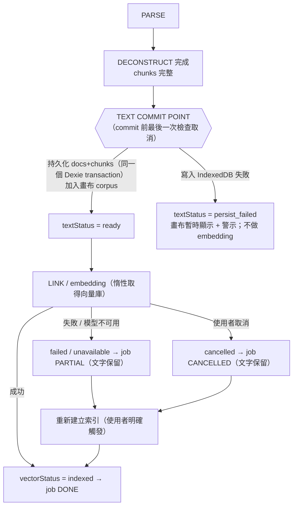

# HyperForge · 混沌煉金工廠

Local-first 知識煉金工廠（開發中，目前完成：投放口、管線動畫、向量庫與多語言 embedding、第 4 輪「Infinite Alchemy Canvas」概念圖譜畫布）。

## 開始

需要 Node.js LTS 20 或 22。首次 `npm install`，再取得自託管的模型與 wasm（約 135 MB，不入版控）：

```bash
npm install
npm run fetch-model   # 下載多語言 embedding 模型（約 135 MB，SHA256 校驗）到 public/models，複製 onnxruntime wasm 到 public/ort
npm run dev
npm run typecheck
npm test
```

## 目前狀態

| 階段 | 狀態 |
| --- | --- |
| PARSE / DECONSTRUCT / **TEXT COMMIT** / LINK | 文字類檔案與貼上文字為真實處理；token 為近似值（CJK 逐字、其餘以空白分詞）。DECONSTRUCT 完成後先做 **text commit**（持久化 docs + chunks、加入畫布），之後才 LINK = 關鍵字 + 向量化（embedding → 寫入向量 → 插入記憶體 HNSW）。向量化是可失敗、可取消、可重試的附加能力，見下方「Text-first persistence」 |
| RECOMBINE / EVOLVE / MANIFEST | skipped / 未接入，進度條不動（只在各自的列上標「未接入」，**不**影響 job 狀態） |
| 畫布（第 4 輪） | 概念圖譜 Canvas：只依賴文件文字，與 embedding 解耦；見下方「畫布」一節 |
| PDF / 圖片 / 音訊 / 影片 / zip | 尚未支援，拖入會顯示錯誤 |
| URL（YouTube / GitHub / 網頁） | 尚未支援（不發任何網路請求），顯示錯誤 |
| DECONSTRUCT 進度 | 切 chunk 為同步純函式，進度一次跳到 100%，非逐塊真實進度 |
| 中文關鍵字（LINK 階段） | LINK 的關鍵字抽取會濾掉單字 token，中文暫無關鍵字（job 卡片上的列表）；畫布有獨立的概念抽取，見「畫布」一節 |

## 畫布（第 4 輪 · Infinite Alchemy Canvas）

資料流（圖譜只依賴「文件文字 + chunk 位移」，**不依賴向量**；embedding / 模型不可用時畫布照常運作）：



- **兩條來源**：剛完成的 job 直接以記憶體結果建圖（不重讀 DB）；重新整理後由 IndexedDB 的 `docs` / `chunks` 重建（只讀這兩張表，不建立 embedder）。同一份內容（SHA-256 / 相同文字）只算一次。
- **文字先行持久化**：`saveDocument` 在向量化之前／無論成敗都寫入文字；之後若向量化成功，`VectorStore.ingest` 對同一 docId **只補寫向量**（本輪為此修改了 `index-store.ts`；舊行為是向量化成功才寫入任何資料）。
- **向量化失敗只降級，不影響畫布**：`runPipeline` 的 LINK 階段把 `isAvailable` / `ingest` 的任何失敗（模型檔存在但載入或推論失敗等）降級為 `vectorStatus = failed / unavailable`（job 為 PARTIAL，LINK 註記失敗原因，不使用假向量），文字照常進畫布與 IndexedDB；只有取消（AbortError）會往外丟。
- **向量／語意狀態**只是狀態列資訊（`lib/vector/status.ts` 對同源模型檔發 HEAD，缺模型時只發 1 個請求），畫布不等待它。
- **概念抽取**（`lib/graph/extract.ts`）：句子 → 依 Unicode script 切 run → Latin token／Han 段（以標點與停用詞切段）→ 2–3 字 n-gram → 以「重複出現的片段覆蓋最多字」選詞（DP）→ 詞頻／文件頻率評分。**中文為統計近似，非中文斷詞**；無詞典、無 NLP tokenizer。詞需在語料中至少出現 2 次，文件至少 8 個單位才納入。
- **人名**僅為**英文啟發式（heuristic）**（連續 2–3 個首字大寫單字，或 Dr./Mr./Ms. + 姓）；非 NER、非 AI，不支援中文人名；UI 與資料模型皆標 `heuristic`。
- **邊**只有 co-occurrence（同一句子內共同出現，權重＝句數）。**沒有** vector-similarity／semantic 邊；那需要另開一輪設計（chunk vector → 概念證據歸屬 → 概念相似度），不可直接全對全 cosine。
- **上限**（`lib/graph/constants.ts`）：`MAX_GRAPH_NODES = 150`、`MAX_GRAPH_EDGES = 600`；超過時依分數／權重截取，UI 明示「顯示前 150 個概念（共 N 個）」。
- **決定性**：節點 id ＝ `kind:正規化詞`；初始位置只取決於節點 id（seeded），所以新增文件不會讓既有節點跳位；physics 無隨機數。
- **Physics**（`lib/graph/physics.ts`）：排斥、彈簧、中心重力、阻尼、每 tick 碰撞分離、拖曳 pin、固定時間步長、休眠。O(n²) 排斥，規模設計為 ≤ 約 170 節點。位置／速度在 ref（`GraphController`），不每 frame 寫 React state；rAF 迴圈由 `FrameLoop` 管理（cleanup、單一迴圈、休眠即停）。
- **互動**：空白處拖曳＝平移；Shift+拖曳（或「框選模式」）＝框選（任意方向）；滾輪＝以游標為中心縮放（native `{ passive: false }` + `preventDefault`）；拖節點＝pin → 移動 → 放開；點擊／Shift+點擊選取；「適合畫面」；右鍵 →「煉成新概念」。
- **煉成新概念**：選取 ≥ 2 個節點後右鍵，產生**本機暫存**節點（可自訂名稱，預設 `A × B`）。不呼叫 AI、不寫 IndexedDB、標示「暫存」，重新整理即消失。
- **安全**：節點名稱以 Canvas `fillText` 繪製；Source panel 只用 React text node。`lib/graph/security.test.ts` 以 hostile fixture 驗證，並掃描原始碼禁止 `innerHTML` / `dangerouslySetInnerHTML` 等。
- **測試輔助**：網址帶 `?e2e=1` 時，頁面會掛上**唯讀**的 `window.__HYPERFORGE_E2E__`（節點螢幕座標、frame 計時），供 `scripts/e2e/` 的瀏覽器驗收使用；正式使用不需要。

### 概念抽取的已知限制（皆未做準確率評估）

- 中文統計近似會產生：泛用動詞／名詞（保持、安裝、施工…）、重複出現的片語被當成詞、4 字以上詞被切成兩個 2 字詞。停用詞表為手工清單，覆蓋度未評估；3 字詞凝聚度門檻 `0.8` 為經驗值，未對大型語料校準。
- 只處理 Han 與 Latin 兩種 script（不含假名、諺文）；Latin 不做詞幹還原（單複數視為不同詞）。
- 人名 heuristic 會把 Title Case 片語誤判為人名，也會漏掉小寫或單一名字；誤判率未量測。
- 句子邊界為規則式（`。！？；!?;` 與換行；`.` 僅在後接空白、前非數字且非縮寫時）。
- `buildGraph` 在**主執行緒同步**執行，且每新增一份文件就重算整個語料（Web Worker 為後續輪次）。Node 實測：2 萬字 67 ms、20 萬字 360 ms、100 萬字（隨機漢字最壞情況）約 3.2 秒。
- 150 節點在「適合畫面」時標籤會做防碰撞省略，放大後才會出現較多標籤。
- 尚未實作文件（source/document）節點，也沒有刪除文件的 UI。

### 瀏覽器驗收

```bash
npm run build && npm start                       # 必須是正式 build
node scripts/e2e/canvas-acceptance.cjs           # 需 Playwright；Part A–C 假設模型檔未安裝；Part D / E 由 Playwright 提供合成模型。E2E_ONLY=embed-failure|text-first|text-first-edge 只跑單一部分
npx next dev -p 3100 && node scripts/e2e/strictmode-single-loop.cjs   # 另見檔頭說明的限制
```

## Text-first persistence / 取消語意（第 5 輪）

原則：**文字是 primary data，向量是 derived data**。embedding 是否可用、是否成功、是否被取消，都不能決定文件是否存在。



- **Text commit point**（`lib/pipeline/runner.ts` 的 `onTextReady`）：只在 PARSE 成功且 DECONSTRUCT 完整產生 chunks 之後呼叫，只呼叫一次；呼叫前最後一次檢查 AbortSignal，進入後取消**不 rollback**。不逐 chunk 邊解析邊寫 DB。向量庫（`getVectorStore`，初始化可能很慢）改為 commit **之後**才惰性取得。
- **取消語意**：PARSE / DECONSTRUCT 期間或 commit 前一刻取消 → `cancelled`，DB 與畫布都沒有任何資料；commit 之後取消（含 embedding 進行中）→ 仍是 `cancelled`（**不是** `partial`），但文字保留於 IndexedDB 與畫布，UI 顯示「文字已保留 / 語意索引已取消 / 重新建立索引」。取消會立即生效（對 `getStore` / `isAvailable` / `ingest` 做 abort race）；底層推論無法中止、會在背景跑完，但取消後不會寫入向量（`ingest` 在寫入 transaction 前再檢查一次 signal）。
- **狀態模型**（`lib/pipeline/types.ts`）：`TextStatus = pending | ready | persist_failed`；`VectorStatus = pending | indexed | failed | cancelled | unavailable`；job 狀態 `running | done | partial | cancelled | error`（`done` 即規格的 completed）。`done` ＝ 文字 ready 且向量 indexed；`partial` ＝ 非使用者原因導致附加能力沒完成；`cancelled` ＝ 使用者取消；`error` ＝ PARSE / DECONSTRUCT 失敗。
- **文字持久化失敗**：不靜默吞掉。job 為 partial、`textStatus = persist_failed`，畫布可暫時顯示，UI 標示「尚未儲存，重新整理後可能遺失」；**保守策略：不做 embedding**（避免只有衍生資料、沒有原文），也不提供重新建立索引。
- **重新建立索引**（Retry indexing）：只對「文字 ready 且向量尚未完成（也不在建立中）」的文件開放，只由使用者按鈕觸發。流程：IndexedDB 的 docs / chunks → embed → 補寫向量；不重新 PARSE / DECONSTRUCT，不新增 document / chunks（chunk 主鍵決定性，向量以 `bulkAdd` 寫入、已存在即視為 duplicate）。失敗則文字不變。**沒有任何自動重試**：無計時器、無背景重試、無啟動時重試、模型變可用時也不會自動重試。
- **重新匯入同一份內容**：reuse 既有 text / chunks（SHA-256 決定性 id）；向量已存在則不重複 embedding，只有文字則補建向量。model mismatch 沿用既有規則（向量庫不可用 → `unavailable`）。
- **重新整理後**：文字一定是 ready（能讀到就代表已 commit）；語意索引由 IndexedDB 的向量筆數推得（`loadVectorPresence` 只讀向量表主鍵、不載入向量、不初始化 embedder）——筆數 ≥ chunk 數為「已完成」，否則為「尚未建立」並可重試。重新整理前的 `failed` / `cancelled` / `unavailable` 區別不會保留（不需要區分）。
- **原子性**：document 與其 chunks 在同一個 Dexie transaction 寫入（`saveDocument`），任何一步失敗整體 rollback；冪等（重複 commit 不增加 document / chunk 數量）。
- **UI**：job 卡片與「Documents」清單顯示「文字：… · 語意索引：…」與「重新建立索引」；取消後仍留在畫布的文件不標成錯誤。

### 第 5 輪的已知限制

- embedding 在 **Web Worker** 執行（`lib/vector/embed.worker.ts`，主執行緒只傳訊息）：**embedding 期間主執行緒沒有長任務**（只有推論離開了主執行緒；`deconstruct` 切 chunk 與 `buildGraph` 仍在主執行緒，不要解讀成「整頁都不卡」）。Worker 一次只處理一個請求（FIFO 佇列），多檔並發時其餘排隊。取消**進行中**的請求會終止 Worker 以真的停止運算（模型在下次需要時於新 Worker 重新載入，約 2 秒），佇列中尚未開始的請求在新 Worker 上**重新派送**（不是失敗重試：被取消或失敗的請求不會再執行）；取消**佇列中**的請求只是把它移出佇列。Worker 自己出錯時，進行中的請求失敗、不自動重試。Worker 只在第一次 embed 時建立；開發時 HMR 重建模組會先終止舊的 Worker。Worker 不可用時**不退回主執行緒**（會再次凍結），向量化直接降級為「不可用（Worker 不可用）」。
- 「重新建立索引」進行中**不可取消**，也沒有逐 chunk 進度（只有整份文件的進度回報）。
- 重新整理後無法區分「先前是失敗 / 取消 / 模型不可用」，一律顯示「尚未建立」。
- 已結束的 job（cancelled / partial）本身的狀態不會因為之後 retry 成功而改變（那是歷史事實）；卡片與文件清單上的「語意索引」欄顯示的是**文件目前的狀態**。
- `done` 不代表 RECOMBINE / EVOLVE / MANIFEST 已完成（它們尚未接入，只在各列標示）。
- 取消與向量寫入之間有一個極小的時間窗：`ingest` 在開 transaction 寫入向量之前會再檢查一次取消；若取消剛好發生在那次檢查**之後**、transaction 完成**之前**，job 會顯示 `cancelled`、文件顯示「已取消索引」，但向量其實已經寫入；重新整理後該文件會顯示「已完成」。文字與資料仍然一致，只是取消時序（審查意見 [建議]）。
- 瀏覽器驗收（作者自測，未經獨立執行）的「向量化成功」使用**合成 ONNX 模型**（`scripts/e2e/synthetic-model.cjs`，**沒有語意**，不是 MiniLM）走真的 `TransformersEmbedder` + onnxruntime-web：它只證明「管線有接通、寫入與取消行為正確」；**真模型的端到端向量化仍未驗證**（此環境無法下載）。

## 向量庫（第 2 輪）

- `lib/vector/hnsw.ts`：自建 HNSW（cosine、可重現 seed、可序列化）。
- `lib/vector/db.ts`：Dexie schema v1（`docs` / `chunks` / `vectors` / `meta`）。向量獨立成表；chunk 主鍵 `docId:index`，docId 為內容 SHA-256。未來欄位變更請新增 `version(2).upgrade`，不要改 `version(1)`。
- `lib/vector/index-store.ts`：寫入具原子性（取消或失敗不留半個 doc）；`meta` 記錄 embed 模型與維度，不符時拒絕（`ModelMismatchError`）。
- HNSW 索引只存記憶體，啟動時由 `vectors` 表重建；大型庫重建成本與索引持久化列待辦。
- **真 embedder**：`lib/vector/transformers-embedder.ts`（`@xenova/transformers` v2 舊套件，預設為多語言 paraphrase-multilingual-MiniLM-L12-v2 量化版，dim 384；詳見下方「Embedding 模型須知」）。僅限瀏覽器；模型與 wasm 自託管於 `public/models`、`public/ort`，`allowRemoteModels=false`，不連外。`next.config.mjs` 把 `sharp`、`onnxruntime-node` alias 為 false。模型檔不存在時 `isAvailable()` 為 false，管線降級為 PARTIAL（不用假向量）。`lib/vector/runtime.ts` 以單一 promise 初始化全域 VectorStore。`FakeEmbedder`（`fake-embedder.test-util.ts`）僅供測試，`lib/no-fake-in-product.test.ts` 會檢查非測試檔不得 import。
- 內容雜湊用 `crypto.subtle`，只在 `localhost` 或 https 可用（用區網 IP 開 dev 會失敗）。

## 一鍵七變（右側工廠；進行中，分三階段）

針對**當前圖譜**產生 7 種輸出，皆可複製／下載。**沒有 AI**：全部是本地、決定性的「抽取＋模板」——內容來自原文句子（附文件名與位移），模板只負責排版，不憑空造事實；每個輸出都標示「抽取式（統計近似），非 AI」。

| 階段 | 輸出 | 狀態 |
| --- | --- | --- |
| A | 核心摘要（3 行 + 10 點）、Notion 資料庫 JSON、共用 `digest` | 已實作 |
| B | 心智圖（可摺疊、鍵盤可操作的樹）、簡報大綱（最多 10 頁 + 講稿）、Threads 三種版型 | 已實作（待審查／提交） |

**階段 B 的規則**
- **心智圖**（`lib/outputs/mindmap.ts`）：圖不是樹，生成樹規則寫死且可測——每個連通群組各有一個根（群組內分數最高者，同分取 id 較小者）；群組依根的分數排序，最多顯示 5 個（其餘只計數並標示「另有 N 個群組」，不默默消失）；BFS 深度 = 到根的最短跳數；多個可能的父節點時掛在「邊權重最大者」，同權重取 id 較小者（不是先到先掛）；每個父節點最多 6 個子節點、最多 3 層，被略過的標示「還有 N 個未顯示」；節點標籤只是 term，點開（Enter／Space／點擊）才顯示原文 quote。UI 為 `role="tree"`／`treeitem`，`aria-level`／`aria-expanded`／`aria-selected`、roving tabindex、可見焦點樣式；↑↓ 移動、→ 展開或進入第一個子節點、← 收合或回到父節點、Home／End、Enter／Space 顯示原文。互動邏輯是純函式（`tree-state.ts`）。
- **簡報大綱**（`slides.ts`）：封面（來源文件）、重點概念、最多 7 頁概念頁（標題只是 term；條列 ≤2 句引文；講稿 ≤3 句引文）、概念關聯（共現次數取自圖譜）。講稿只由引文組成；不足 10 頁照實少給並說明。
- **Threads**（`threads.ts`）：規格原本是「專業／嗆辣／故事」。沒有 AI 時「嗆辣」需要新增斗氣的斷言、「故事」需要捏造情節或第一人稱經驗，違反「不造事實」，所以**依使用者決定改為三種誠實版型**：專業（• 條列引文）、密排（引文依子句標點拆成一行一個子句，只靠標點與換行，不新增文字）、串接（依文件名稱、同文件內依原文位置串接引文；文件之間的先後是內部排序，不是上傳順序，且各句原本不一定相鄰、指代可能對不上）。每則 ≤ 500 字元、最多 3 則、附來源與 (i/n) 編號。**一律以整句為進出單位**：一句（含頁碼與來源行）放不下就整句略過並記入說明，3 則上限也只收整句；密排只是把一句重排成多行，不會把一句拆進不同貼文或丟掉其中某個子句。複製與下載是**純文字**（貼到 Threads，不做 Markdown 跳脫）；簡報、摘要、心智圖的 `.md` 與複製都是跳脫後的 Markdown。
- 白名單新增的框架只命名頁面角色或是標點／連接符；含數字的框架（共現次數、還有 N 個未顯示、頁碼、則數）以**樣式**比對，數字來自圖譜統計而非原文，各輸出的測試用獨立計算驗證數字。
- 效能（Node，兩份語料各 1 萬／10 萬字、22 個概念）：`buildDigest` 5／37 ms；每個分頁的計算（摘要、Notion、心智圖、簡報、Threads 三版型）皆 <5 ms；只在被選取的分頁才算。瀏覽器內未量測。
| C | 反問提示（規則式，非論證）、金句卡（1080×1080 PNG） | 已實作（待審查／提交） |

**「模板不得造事實」是可被機器檢查的**（`lib/outputs/segments.ts`）：每個輸出項目都先表示成片段——`quote`（原文切片，`text === rawText.slice(start,end)`）、`term`（圖譜概念名稱，必須出現在同一項目引用的原文中）、`ref`（文件名稱）、`frame`（模板框架，只允許固定白名單：標號、標點、標題、固定標籤，不得含對內容的判斷）。Markdown 與畫面都由同一份片段產生，測試（`verify.test.ts`）逐項檢查，並有負向測試證明檢查器真的會抓到違規。新增輸出若需要新的框架字串，必須加進白名單並通過審查。

資料基礎與畫布相同：`OutputsPanel` 收到的是畫布當下的 `docs` 與 `graph`（同一次 render、`useMemo` 以它們為 key），語料變動即重算，不會顯示過期內容；面板固定顯示「基於 N 份文件、圖譜上顯示的 M 個概念」，概念被 150 上限截斷時另註明「共 X 個，其餘未納入」。輸出只使用圖譜上顯示的概念。結果與輸入文件順序無關（依文件 id 排序；測試涵蓋打亂順序）。

- `lib/outputs/digest.ts`：重跑 `extractConcepts`（取完整 occurrence 與句子序號；圖譜的 evidence 只留 40 筆），以「句內不重複概念的 score 總和 / 長度正規化」排序句子（12–140 字元），去近似重複；`selectDiverse` 貪婪挑「涵蓋不同概念」的句子。暫存（煉成）節點不進輸出。
- 資料不足時**照實少給並說明原因**（不湊數）：例如整段沒有標點、句子過長，會說明「有 N 個概念但找不到長度適中的原文句子」。
- **Notion JSON** 形狀對齊 Notion API（Name/Type/Frequency/Documents/Source），但**未驗證能被 Notion 實際匯入**；`parent` 是占位符，需自行填入頁面 ID。已處理的限制（來源與查閱日期 2026-10-03）：
  - [Request limits](https://developers.notion.com/reference/request-limits)：rich text 的 `text.content` ≤ 2000 字元（超過時**切成多段**，不截斷）；multi_select 一次 ≤ 100 個選項（超過時截為 100 並寫入 `warnings`）；單一請求 ≤ 1000 區塊與 500KB（資料庫定義超過時寫入 `warnings`）。
  - [Property object](https://developers.notion.com/reference/property-object)：選項名稱「不分大小寫需唯一、不可含逗號」（逗號換成空白、大小寫不同者歸併到第一個寫法；文件名含逗號很常見）。
  - 選項名稱 ≤ 100 字元：**文件沒有明說**，是我保守設定的上限（未驗證）。空名稱改為「(未命名)」。
- **複製**用 `navigator.clipboard`（需 https 或 localhost、需使用者操作），失敗退到 `execCommand`，再失敗會顯示原因並建議改用「下載」。內建瀏覽器中程式碼觸發的複製會因「文件未取得焦點」失敗，真實點擊則成功（顯示「已複製」；剪貼簿內容無法回讀驗證）。
- 使用者原文只以 React 文字節點顯示；匯出的是 UTF-8 純文字檔（Markdown / JSON），不是 HTML。
- 限制：摘要品質受限於既有的句子切分與概念抽取（中文為統計近似）；`buildDigest` 在主執行緒同步執行，語料變動就重算（等於在 `buildGraph` 之外再多一次抽取）。Node 實測：0.29 MB 約 67 ms、1.17 MB 約 264 ms（`buildGraph` 同量約 94 / 342 ms，所以每次新增文件的主執行緒成本約為原本的 1.8 倍）；瀏覽器內未量測。小語料：1 萬字 `buildDigest` 約 4 ms、10 萬字約 24 ms（`buildGraph` 同量約 5 / 35 ms）。摘要與 Notion 的組裝本身 <1 ms。
- **Markdown 匯出會跳脫使用者內容**（`lib/outputs/markdown.ts`）：匯出的 `.md` 會被帶到別的檢視器，原文與文件名是不可信內容。`quote` / `term` / `ref` 一律經 `escapeMarkdown`（反斜線跳脫 `` \ ` * _ [ ] ( ) < > ! # | ~ & @ { } ``、行首的 `-` `+` `>` `1.`、自動連結的 `scheme:` 與 `www.`），渲染後顯示結果仍等於原句；`frame` 是固定白名單，不跳脫。取捨：純文字檢視器會看到反斜線（安全優先）。測試涵蓋圖片、連結、HTML、標題、清單、引用、自動連結、email，並以固定 seed 的隨機字串驗證「跳脫再還原等於原文」。之後所有輸出的 `.md` 都必須走這個函式。
- **效能原則**：資料基礎只讀圖譜統計（便宜）；較重的 `buildDigest` 只在面板展開且有概念時才算，摘要與 Notion 只算「目前被選取的分頁」；之後 B/C 階段新增輸出也維持「用到才算」。
- **Notion 的使用流程是兩步**：先用 `database` 建立資料庫（`database.parent` 填頁面 ID），再把得到的 database id 填進每個 page 的 `parent`（占位符 `<建立資料庫後填入>`）。仍**未驗證能被 Notion 實際匯入**。
- **複製失敗的退路**：複製失敗（權限被拒、非安全環境、文件未取得焦點）時，顯示原因並展開一個唯讀、自動全選的文字區（含完整內容），使用者可按 Ctrl+C，或改用下載。下載檔名會過濾路徑與 Windows 保留字元，也避開保留裝置名稱（CON、PRN、AUX、NUL、COM1–9、LPT1–9 會加上底線前綴）；Blob URL 用完即 revoke。
- **畫布版面驗證**（面板加入右欄後；新載入頁面）：1280×900（dpr 1，兩欄）畫布 734×558，緩衝區與 controller 尺寸一致，3/3 命中測試正確；375×812（dpr 2，單欄）畫布 325×558，緩衝區 650×1116 與 DPR 相符，3/3 命中正確、無橫向捲動。**未驗證**：頁面載入後 DPR 才改變、或視窗被拖動縮放時的重設行為——內建瀏覽器的分頁處於 hidden，`ResizeObserver` 與 rAF 被暫停，實測時畫布緩衝區沒有跟著 DPR 變動（767 vs 預期 1150）；我新增了「每個 frame 檢查 `devicePixelRatio`」與 `matchMedia` 監聽來處理 DPR 改變，但這段在 hidden 分頁中無法驗證。

## Embedding 模型須知

- **預設模型**：`Xenova/paraphrase-multilingual-MiniLM-L12-v2`（量化，384 維，約 118 MB，另有 tokenizer 約 17 MB），支援繁中。`npm run fetch-model` 固定到 commit `2c4055b1…`，每個檔案都寫死 byte size 與 SHA256（onnx 與 tokenizer.json 為 HF LFS 公布的 oid；小檔無上游雜湊，為一次性人工確認），下載到 `.tmp` 驗證通過才 rename。授權請自行在 HF 模型頁核對。
- 英文模型 `all-MiniLM-L6-v2`（約 23 MB）腳本仍支援（`node scripts/fetch-model.mjs --model=minilm-l6`），**但不是預設**，且程式目前只載入預設模型；是否移除之後再決定。
- **切窗**：以 tokenizer 實際 token 數切 window（不用字數猜），每窗內容 ≤ 126（`maxSeq=128` 扣掉 [CLS]/[SEP]；128 來自模型卡 `max_seq_length`，寫在 `lib/vector/model-spec.ts`，並檢查 ≤ `tokenizer.model_max_length`）。各窗分別推論，以 token 數加權平均後 L2 正規化。
- **成本**：一個 500 近似 token 的 chunk 約切成 4–6 窗各做一次推論（CPU 時間不變，只是不再佔用主執行緒）。實測（瀏覽器、numThreads=1、正式建置）：約 2,200 近似 token 的中英混合文件（6 個 chunk）熱機約 4.9 秒；改用 Worker 後（瀏覽器、正式建置）：約 3,800 近似 token（8 個 chunk）含載入模型約 12.5 秒；剛好 20 個 chunk（9,049 個近似 token）約 30.0 秒，期間 `longtask`（>50ms）只有 1 次、172ms，10ms 計時器的最大間隔 174ms；2 份文件並發、取消其中一份，被取消的 50ms 內結束，另一份在新 Worker 上 2.0 秒完成。**畫布 fps 沒有量到**：內建瀏覽器的分頁處於 hidden，requestAnimationFrame 被暫停。改用前同樣的工作會讓主執行緒整段時間都凍結。
- **Worker 的限制與未驗證項**：
  - 那 1 次 172ms 的 longtask 超過 <100ms 的目標，**來源未查證**：推論在 Worker，所以多半不是推論；可能來自主執行緒的 `deconstruct`、`buildGraph` 或結果寫入，但沒有用 Performance 面板確認，不要當成已解釋。
  - **未驗證**：畫布 fps（內建瀏覽器分頁為 hidden，rAF 被暫停，量不到）；開發時 HMR 熱更新是否確實終止舊 Worker（只驗證了 `WorkerEmbedder.disposeAll()` 本身）；低階機器；取消後 CPU 確實停止只有間接證據（取消後下一份小文件 2.1 秒完成），沒有用 DevTools 直接看。
  - **Worker 卡死（沒有回應）時沒有逾時機制**，只能由使用者取消。`postMessage` 失敗（例如 DataCloneError）會改回傳錯誤，不會讓請求懸著。
  - Worker 內仍是單執行緒推論（`numThreads=1`），吞吐量沒有提升。
- **文件大小上限**（Worker 之前為了避免凍結頁面而加入，**目前仍保留，是否移除／改為「運算時間保護」待決定**）：超過 `MAX_EMBED_CHUNKS`（20 個 chunk；約 50KB 英文或 27KB 中文，`lib/pipeline/limits.ts`）的文件**只略過向量化**：文字仍會保存、圖譜照常建立（文字處理很快），job 為 PARTIAL，文件標示「文件過大」且不提供「重新建立索引」。Worker 之後頁面不再凍結，但 CPU 時間不變（0.6MB 單檔仍需數分鐘，只是可取消、頁面可操作），所以上限現在是「運算時間保護」，不是「凍結保護」。
- **舊資料庫**：換模型後 IndexedDB 內舊向量不可混用。偵測到時，job 的 LINK note 會顯示「向量庫為舊模型建立，需重建」並降級為 PARTIAL。重置：DevTools → Application → IndexedDB → 刪除 `hyperforge`；或在程式中呼叫 `resetVectorDb()`（`lib/vector/runtime.ts`），再重新載入頁面。
- `@xenova/transformers` v2 已停止維護，內含較舊的 onnxruntime-web（1.14.0）。wasm 由 `scripts/copy-ort.mjs` 從該套件實際解析到的 onnxruntime-web 複製。
- `next.config.mjs` 的 alias 只對 webpack 生效：**dev / build 請勿加 `--turbopack`**。
- 「離線」目前指**不依賴外部網路**（模型、wasm、字型皆為本機來源；實測所有請求的 origin 只有 localhost）。專案尚無 service worker，PWA 離線快取是後續輪次，屆時需預快取 `public/models`、`public/ort`。
- `vitest` 不涵蓋真模型（只用注入的假 extractor/tokenizer 測邏輯）。真模型的繁中語意 baseline 見 `lib/vector/baselines/zh-semantic.json`（含模型 revision、SHA 與取得方式），只能在瀏覽器重新取得。

## npm audit（尚未處理，未使用 --force）

共 12 項（critical 2、high 6、moderate 4）。處理原則：不強制升 Next / Transformers / ONNX（皆為 breaking）。

| package | severity | 路徑 | 進 production bundle？ | 備註 |
| --- | --- | --- | --- | --- |
| protobufjs | critical | @xenova/transformers → onnxruntime-web → onnx-proto → protobufjs 6.11.6 | **是**（onnx proto 程式碼在 client chunk） | 弱點多為「解析不受信任的 proto / 生成程式碼」；本專案只載入固定、已校驗 SHA256 的本機模型，攻擊面小 |
| onnx-proto / onnxruntime-web | high | 同上 | 是 | 隨 protobufjs；修法是降到 @xenova/transformers@1.4.2（反向 breaking，不採用） |
| sharp | high | @xenova/transformers → sharp 0.32.6；next → sharp 0.35.5 | 否（webpack alias 為 false；Next 的 sharp 僅 server 圖片最佳化，本專案未用） | |
| postcss | high | next 內嵌 postcss 8.4.31 | 否（build time CSS 處理） | 修法為 next@16（breaking） |
| next | moderate | 經 postcss | 是（框架本身） | 僅 postcss 轉移；待 Next 15.x 內修補或升 16 |
| vitest / vite / esbuild / @vitest/mocker / vite-node | critical / high / moderate | devDependencies | 否（僅開發測試；弱點需開 Vitest UI / dev server 才觸發） | 修法為 vitest@5（breaking），可之後單獨升 |

可行方案：(1) 現況可接受（本機工具、固定模型）；(2) 單獨升 vitest 5 處理 dev 類；(3) 等 Transformers.js v3（@huggingface/transformers，新版 onnxruntime-web）再評估遷移，需使用者決定。

## 待辦備忘

- embedding 的 `numThreads=1`（多執行緒需 COOP/COEP）；Worker 內仍是單執行緒推論，吞吐量沒有提升。
- 巨檔切 chunk 會同步佔用主執行緒，需改為分批或 Worker。
- `Chunk` 的 start/end 位移已就緒；之後存 DB 需定 schema 版本。
- 若 `framer-motion` 與 React 19 出現 peer 衝突，請以 `^12` 為準。

- transformers.js / tesseract.js / pdfjs 的模型與 wasm 預設走 CDN，與零後端、離線 PWA 衝突，後續須自託管至 `public/`。
- `reference/Hyperforge.html`：來源不明的舊 artifact，僅供參考，未被引用（依使用者決定已搬入）。


**階段 C 的規則**
- **反問提示**（`socratic.ts`；否定／緩和語境——並非所有、不是唯一、未必、不一定、not all、not only…——不算強斷言，視窗為線索前 6 個字元／14 個英文字元；專有詞組如不可燃、所有權、所有人、唯一識別碼、全部門不觸發；`cannot`、`shall not` 算，`can't` 這類縮寫否定不算；**對規範／需求書的條文，「必須」「不得」「禁止」是條文用語，反問只是「請對照出處」，不是在說條文有問題**；問句由表格寫死：全稱→「這個說法有例外嗎？」＋「依據是什麼？」、唯一→「有沒有其他情況？」、必要／禁止→「依據是什麼？」，一個項目最多兩個、不拼接）：**不是「最強反駁」**，沒有 AI。只對原文中含「強斷言線索」的句子（必須／一定／所有／只有／唯一／一律／全部／永遠／絕對／必定／務必／不得／禁止／不可；must／always／never／all／only／every／none／cannot，英文以 `\b` 比對；已排除「一定程度」「不可能」等非斷言用法）引用原句，並附上固定問句：「這個說法有例外嗎？」（全稱）、「有沒有其他情況？」（唯一）、「依據是什麼？」（一律附上）。問句不新增任何斷言。關鍵字比對會有誤判，UI 已說明。最多 3 個；不足就少給並註明；0 個顯示「沒有偵測到強斷言」，不退而求其次造句。
- **金句卡**（`quotecard.ts`、`QuoteCardView.tsx`）：1080×1080 Canvas，內容只有引文行、來源文件名與固定的 HyperForge 浮水印。只選 ≤48 字元的較短句，**不截斷或改寫引文**；放不下就略過並說明。換行是注入 `measure` 的純函式：CJK 逐字量測、英文依空白斷行（超長詞逐字斷）、避頭尾（行首不得是 ，。、；：？！）」』】》… 等；行尾不得是 （「『【《 等，違反時把前一行最後一字移到下一行；連續標點整串處理、……與——不拆開、英文單字與數字串不拆開）、標點懸掛（剛好放不下的行首禁則標點最多 1 個掛在行尾）；全程以 code point 為單位（補充平面漢字與 emoji 不會被切半）；字級 72→40 逐級嘗試。量測與繪製使用同一個字型字串；畫布固定 1080×1080、不乘 devicePixelRatio。文件名也是使用者內容：移除雙向控制字元、過長時量測後截斷加省略號（標籤可以截，引文不行）；含雙向控制字元的引文不選為候選。卡片旁以文字節點顯示同一份引文作為替代文字。繪製前等待 `document.fonts.ready`；字型為系統字型堆疊（專案沒有自託管字型，**不同作業系統外觀會不同**）。下載 PNG 用 `toBlob`；「複製圖片」用 `clipboard.write(ClipboardItem)`，不可用時退回下載並說明。
- 瀏覽器實測（正式建置，dpr 1.5）：canvas 1080×1080、取樣到亮色像素、下載的 Blob 為 `image/png`，**PNG 檔頭簽章與 IHDR 讀出實際寬高 1080×1080**（不受 dpr 影響）、約 800 KB；程式觸發的「複製圖片」因文件未取得焦點失敗而退回下載（顯示原因與檔名）。**未驗證**：不同 OS 的字型外觀、其他瀏覽器的圖片剪貼簿、真實使用者手勢下的複製圖片。
